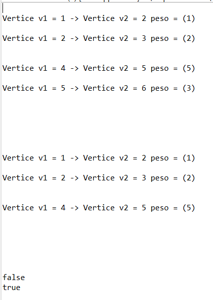
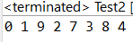
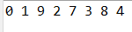
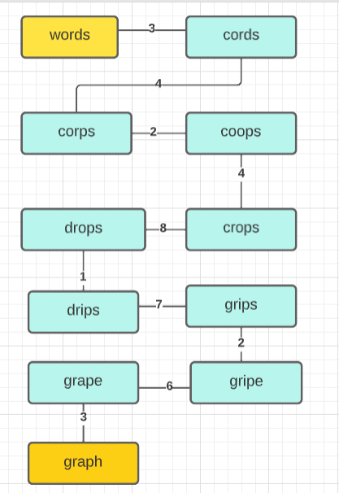
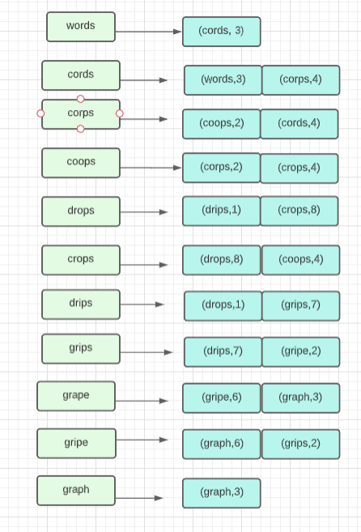
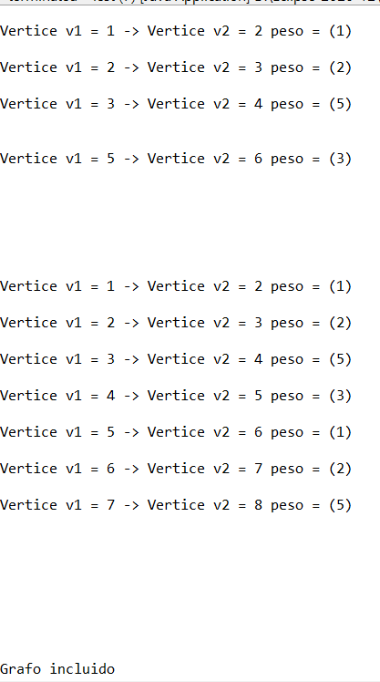

<div align="center">
<table>
    <theader>
        <tr>
            <td></td>
            <th>
                <span style="font-weight:bold;">UNIVERSIDAD NACIONAL DE SAN AGUSTIN</span><br />
                <span style="font-weight:bold;">FACULTAD DE INGENIERÍA DE PRODUCCIÓN Y SERVICIOS</span><br />
                <span style="font-weight:bold;">DEPARTAMENTO ACADÉMICO DE INGENIERÍA DE SISTEMAS E INFORMÁTICA</span><br />
                <span style="font-weight:bold;">ESCUELA PROFESIONAL DE INGENIERÍA DE SISTEMAS</span>
            </th>
            <td></td>
        </tr>
    </theader>
    <tbody>
        <tr><td colspan="3"><span style="font-weight:bold;">Formato</span>:Informe de Práctica de Laboratorio</td></tr>
        <tr><td><span style="font-weight:bold;">Aprobación</span>:  2022/03/01</td><td><span style="font-weight:bold;">Código</span>: GUIA-PRLD-001</td><td><span style="font-weight:bold;">Página</span>: 1</td></tr>
    </tbody>
</table>
</div>

<div align="center">
<span style="font-weight:bold;">INFORME DE LABORATORIO</span><br />
</div>


<table>
<theader>
<tr><th colspan="6">INFORMACIÓN BÁSICA</th></tr>
</theader>
<tbody>
<tr><td>ASIGNATURA:</td><td colspan="5">Estructura de Datos y Algoritmos</td></tr><tr>
<tr><td>TÍTULO DE LA PRÁCTICA:</td><td colspan="5">Grafos</td></tr>
<td>NÚMERO DE PRÁCTICA:</td><td>08</td><td>AÑO LECTIVO:</td><td>2022 A</td><td>NRO. SEMESTRE:</td><td>III</td>
</tr>
<tr>
<td>FECHA DE PRESENTACIÓN:</td><td>21-Agosto-2022</td><td>HORA DE PRESENTACIÓN:</td><td colspan="3">23:55</td>
</tr>
<tr><td colspan="4">Integrantes:
        <ul>
            <li><h5>Machicao Quispe, Gabriel Steven</h5></li>
        </ul>
    </td>
    <td colspan="2">Nota:</td>
</tr>
<tr><td colspan="6">DOCENTES:
<ul>
<li>Richart Smith Escobedo Quispe - rescobedoq@unsa.edu.pe</li>
</ul>
</td>
</tr>
</tdbody>
</table>

<table>
 <theader>
        <tr><th>SOLUCIÓN Y RESULTADOS</th></tr>
	 </theader>
    <tbody>
        <tr><td colspan="6">I. SOLUCIÓN DE EJERCICIOS/PROBLEMAS
	<h2>Implementar el cogido de Grafo cuya representacion sea realizada mediante LISTA DE ADYACENCIA.</h2>
<p> Se hace la siguiente clase llamada Grafo con los métodos correspondientes para almacenar vectores y estos formen aristas, para realizar la lista de  adyacencia se debe hacer grafos dirigidos, es por ello que la clase se dedica a crear dichos grafos; el programa se encuentra en grafosI</p><br>

	    
```java
	    
private Nodo grafo[];
        private int nroVertices;

        class Nodo {
                int vertice;
                int pesoArista;
                Nodo sgte;

                public Nodo(int v, int a) {
                        this.vertice = v;
                        this.pesoArista = a;
                        this.sgte = null;
                }
        }
```
Los métodos que determinan la creación de una arista, depende del método booleano existeArista, que averigua si existe la arista, para luego que lo use el método insertaArista para cuando exista devuelva un mensaje y si no, inserte dicha arista con sus vectores

```java
	     public boolean existeArista(int v1, int v2) {
                if (grafo[v1] == null)
                        return false;
                Nodo actual = grafo[v1];
                while (actual != null) {
                        if (actual.vertice == v2)
                                return true;
                        actual = actual.sgte;
                }
                return false;
        }

        public void insertaArista(int v1, int v2, int peso) {

                if (!existeArista(v1, v2)) {
                        Nodo nuevo = new Nodo(v2, peso);

                        if (grafo[v1] == null) {
                                grafo[v1] = nuevo;
                        } else {
                                Nodo actual = grafo[v1];
                                while (actual.sgte != null) {
                                        actual = actual.sgte;
                                }

                                actual.sgte = nuevo;
                        }
                } else {
                        System.out.println("Ya existe una arista entre:" + v1 + " y " + v2);
                }
        }
```
Luego se crea eliminarArista que también usa el mismo método de insertar para luego hacer el reemplazo y eliminación de la arista y del vertice o los vertices determinados, también se crea un mostrar grafo para imprimir el resultado.

```java
	    public void eliminarArista(int v1, int v2) {
                if (existeArista(v1, v2)) {
                        Nodo actual = grafo[v1];

                        if (actual.vertice == v2) {
                                grafo[v1] = actual.sgte;
                        } else {
                                Nodo anterior = actual;
                                actual = actual.sgte;

                                while (actual != null) {
                                        if (actual.vertice == v2) {
                                                anterior.sgte = actual.sgte;
                                                return;
                                        }
                                        anterior = actual;
                                        actual = actual.sgte;
                                }
                        }
                } else {
                        System.out.println("No existe una arista entre: " + v1 + " y " + v2);
                }
        }
	    
		public void mostrarGrafo() {
		    for (int i = 0; i < grafo.length; i++) {
		      Nodo actual = grafo[i];

		      while (actual != null) {
			System.out.printf("Vertice v1 = %d -> ", i);
			System.out.printf("Vertice v2 = %d peso = (%d)\n", actual.vertice, actual.pesoArista);

			actual = actual.sgte;
		      }
		      System.out.println();
		    }
		  }
```
Se hace una prueba a traves del Test que esta en la carpeta mencionada:<br>
<br>
	    <h2>Implementar BSF, DFS y Dijkstra con sus respectivos casos de prueba.</h2><br>
	    Para la implementación del BSF Y DFS, se hace uso de un grafo no dirigido, que se encuentra en la carpeta grafoII, en esta se encuentra las clases Node y grafo que Node tiene los siguientes atributos<br>
	    
```java
	    public class Node {
        int source, dest;

        public Node(int source, int dest) {
                this.source = source;
                this.dest = dest;
        }
}
```
Este Node se usa en la clase Grafo a traves de una doble List de esa clase, que por medio de ciclos y el arralist van introduciendo los elementos y atributos del la clase Node.<br>
```java
	    import java.util.*;
class Grafo {
        List<List<Integer>> adjList = null;
        // Constructor
        Grafo(List<Node> Nodes, int n){
        adjList = new ArrayList<>();
        for (int i = 0; i < n; i++) {
            adjList.add(new ArrayList<>());
        }
        for (Node node: Nodes){
            int src = node.source;
            int dest = node.dest;

            adjList.get(src).add(dest);
            adjList.get(dest).add(src);
        }
    }
}
```
Se hacen dos Test para evaluar cada uno de los métodos en el cuál el Test2 que se hace el BSF, a traves de este método<br>
	    
```java
	    
        public static void recursiveBFS(Grafo graph, Queue<Integer> q, boolean[] discovered) {
                if (q.isEmpty()) {
                        return;
                }
                int v = q.poll();
                System.out.print(v + " ");

                for (int u : graph.adjList.get(v)) {
                        if (!discovered[u]) {
                                discovered[u] = true;
                                q.add(u);
                        }
                }
                recursiveBFS(graph, q, discovered);
        }
```
A lo cual mediante la recursividad se va poco a poco mostrando el siguiente recorrido de los elementos usados:<br>
<br>
En cuanto al otro se hace un Test3 para que se uso el siguiente método:<br>

```java
 public static void DFS(Grafo grafo, int v, boolean[] discovered) {

                discovered[v] = true;

                System.out.print(v + " ");

                for (int u : grafo.adjList.get(v)) {
                        if (!discovered[u]) {
                                DFS(grafo, u, discovered);
                        }
                }
        }
``` 
Que por medio del For va iterando sobre los estados correspondientes a las visitas que realiza, dando el siguiente resultado:<br>
	  <br>
Por ultimo queda el algoritmo de Dijkstra en el cual usa un grafo dirigido, es por ello que se crea dicho grafo dentro de grafoII/Dijkstra, ahí se usa tres clases, el Node, el heap y el grafo, el Node solo se implementa el atributo peso, en el heap, es el que indica el lider de las nodes donde solo tiene dos atributos, el grafo cuenta con los mismos atributos vistos anteriormente, en su Test2 ahí estan dos métodos que permiten recorrer los caminos y mostrarlos<br>
```java
	    private static void getRoute(int[] prev, int i, List<Integer> route) {
    if (i >= 0) {
      getRoute(prev, prev[i], route);
      route.add(i);
    }
  }

  public static void findShortestPaths(Grafo graph, int source, int n) {
    PriorityQueue<Heap> minHeap;
    minHeap = new PriorityQueue<>(Comparator.comparingInt(heap -> heap.weight));
    minHeap.add(new Heap(source, 0));

    List<Integer> dist;
    dist = new ArrayList<>(Collections.nCopies(n, Integer.MAX_VALUE));

    dist.set(source, 0);

    boolean[] done = new boolean[n];
    done[source] = true;

    int[] prev = new int[n];
    prev[source] = -1;

    while (!minHeap.isEmpty()) {

      Heap node = minHeap.poll();

      int u = node.vertex;

      for (Node aux : graph.adjList.get(u)) {
        int v = aux.dest;
        int weight = aux.weigth;

        if (!done[v] && (dist.get(u) + weight) < dist.get(v)) {
          dist.set(v, dist.get(u) + weight);
          prev[v] = u;
          minHeap.add(new Heap(v, dist.get(v)));
        }
      }

      done[u] = true;
    }

    List<Integer> route = new ArrayList<>();
    for (int i = 0; i < n; i++) {
      if (i != source && dist.get(i) != Integer.MAX_VALUE) {
        getRoute(prev, i, route);
        System.out.printf("Ruta (%d —> %d): de Costo Minimo = %d, Ruta = %s\n", source, i, dist.get(i), route);
        route.clear();
      }
    }
  }
```
Con ello se hace la prueba y se nos da el siguiente resultado:
<br>
	    <h2>Solucionar el siguiente ejercicio:</h2>
	    <p>El grafo de palabras se define de la siguiente manera: cada vértice es una palabra en el idioma Inglés y dos palabras son adyacentes si difieren exactamente en una posición. Por ejemplo, las cords y los corps son adyacentes, mientras que los corps y crops no lo son.</p>
	    <h5>a) Dibuje el grafo definido por las siguientes palabras: words cords corps coops crops drops drips grips gripe grape graph</h5><br>
	    <br>
	    <h5>b) Mostrar la lista de adyacencia del grafo.</h5><br>
	    <br>
	    <h4>Realizar un metodo en la clase Grafo. Este metodo permitira saber si un grafo esta incluido en otro. Los parametros de entrada son 2 grafos y la salida del metodo es true si hay inclusion y false el caso contrario.</h4>
	    Para realizar dicho proceso se hace modificaciones en el grafoI, estos cambios se encuentra en el grafoIV, el unico método que se agrega el siguiente:<br>
```java
 public static boolean grafoInclude(Grafos_2 p, Grafos_2 q) {
                int count = 0;
                if (p.nroVertices != q.nroVertices) {
                        int n = 0;
                        if (p.nroVertices > q.nroVertices)
                                n = q.nroVertices;
                        else
                                n = p.nroVertices;
                        for (int i = 0; i < n; i++) {
                                Nodo actual = q.grafo[i];
                                while (actual != null) {
                                        if(p.existeArista(i, actual.vertice))
                                                count++;
                                        actual = q.grafo[i].sgte;
                                }
                        }
                }
                if (count>2)
                        return true;
                return false;
        }
```
El resultado que nos da en el Test2 es el siguiente: <br>

</tr></td>
	   
   </theader>
        <tbody>
        <tr><td colspan="6">II. SOLUCIÓN DEL CUESTIONARIO
         <ul>
         <li>¿Cuantas variantes del algoritmo de Dijkstra hay y cuál es la diferencia entre ellas?
              <ul>
		<p>El algoritmo existe en muchas variantes. El algoritmo original de Dijkstra encontró la ruta más corta entre dos nodos dados, [6] pero una variante más común fija un solo nodo como el nodo "fuente" y encuentra las rutas más cortas desde la fuente a todos los demás nodos en el gráfico, produciendo una ruta más corta árbol .</p>
               </ul>
           </li>
		</ul>
        <li>Invetigue sobre los ALGORITMOS DE CAMINOS MINIMOS e indique, ¿Qué similitudes encuentra, qué diferencias, en qué casos utilizar y porque?
            <ul>
		    <p>Los caminos minimos consiste en encontrar un camino entre dos nodos de manera que la suma de los costes de los nodos que lo constituyen es mínima. Tenemos los algoritmo de Dijkstra, Bellman-Ford, Floyd-Warshall que unos se pueden usar con pesos negativos y otros no, también que son más efectivos en ciertas cantidad y mientras no usen mayormente los números negativos. Su uso son para problemas donde consiste en hallar la mejor forma de ir desde un punto a otro (o a varios otros) porque se requere encontrar la distancia minima recorrida, para hacerlar los procesos, entre varias posibilidades.
            </ul>
        </li>
         </ul>
        </td></tr>
       
 </tbody>
</table>

<table>
    <theader>
        <tr><th>RETROALIMENTACIÓN</th></tr>
    </theader>
    <tbody>
         <tr><td colspan="6">                       </td></tr>
    </tbody>
</table>

<table>
    <theader>
        <tr><th>REFERENCIAS Y BIBLIOGRAFIA</th></tr>
    </theader>
    <tbody>
        <tr><td>
            <ul>
              [1] Weiss M., Data Structures & Problem Solving Using Java, 2010, Addison-Wesley.<br> [2] Escuela de Pedagogía en Educación Matemática, Marcelino Álvarez, et.al., http://repobib.ubiobio.cl/jspui/bitstream/123456789/1953/3/Alvarez_Nunez_Marcelino.pdf<br> [3] http://www.oia.unsam.edu.ar/wp-content/uploads/2017/11/dijkstra-prim.pdf<br>
            </ul></td>
        </tr>
    </tbody>
</table>
